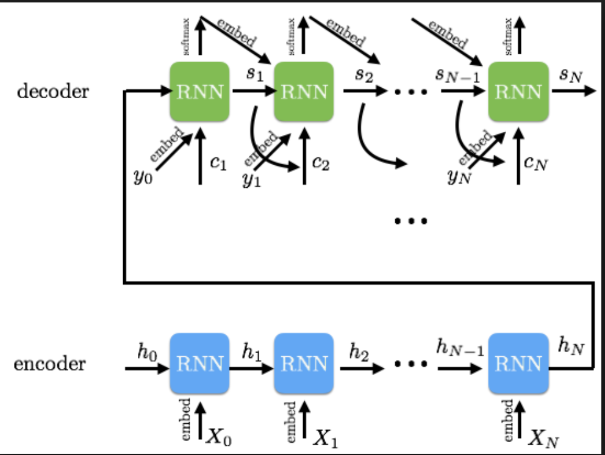

# simple_seq2seq

기본 encoder decoder모델을 어린왕자 데이터셋을 활용하여 구현하였다. 
(데이터 셋은 골빈해커3분 텐서플로우 튜토리얼 중의 챗봇 학습 데이터를 가져왔으며 chatbot 코드를 참고하여 작성하였습니다)

encoding: 문장을 vector로 변환한다.
decoding: 인코딩된 vector로 부터 문장을 생성한다.
## Requirements

- Python 3.6
- TensorFlow 1.4

## Reference

- [stack_bidirectional_rnn](https://www.tensorflow.org/api_docs/python/tf/contrib/rnn/stack_bidirectional_rnn) - Tensorflow
- [dynamic_rnn](https://www.tensorflow.org/versions/r1.3/api_docs/python/tf/nn/dynamic_rnn) - Tensorflow

## Author
junbeomlee
